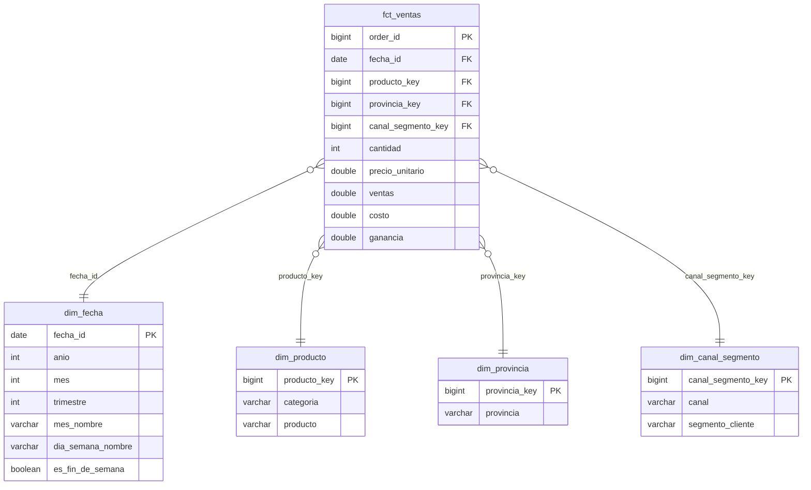

# Analytics Engineering — Modelo dimensional de ventas retail

Pipeline ELT que transforma datos crudos de ventas en un **modelo dimensional (esquema estrella)**, siguiendo la arquitectura por capas típica de herramientas como dbt: `raw → staging → marts`. Incluye tests de calidad de datos automatizados.

El objetivo de este proyecto no es el análisis en sí, sino mostrar **cómo modelar datos para que sean fáciles, rápidos y confiables de consultar** — el trabajo central de un Analytics Engineer.

## 🏗️ Arquitectura del pipeline

```
raw/                    staging/                  marts/
┌─────────────────┐    ┌─────────────────┐    ┌──────────────────────┐
│ ventas_retail_   │───▶│ stg_ventas       │───▶│ fct_ventas (hechos)  │
│ argentina.csv    │    │ (limpieza,       │    │ dim_fecha            │
│ (dato crudo)     │    │  tipado,         │    │ dim_producto         │
│                  │    │  normalización)  │    │ dim_provincia        │
└─────────────────┘    └─────────────────┘    │ dim_canal_segmento   │
                                                └──────────────────────┘
```

- **`raw/`** — el dato tal cual llega de la fuente, sin tocar.
- **`staging/`** — limpieza y estandarización pura: tipos de datos correctos, texto normalizado, sin lógica de negocio todavía. Responsabilidad única.
- **`marts/`** — el modelo final, listo para que un analista o una herramienta de BI (Tableau, Power BI, Looker) lo consuma directamente, sin necesitar más transformaciones.

## ⭐ Modelo dimensional (esquema estrella)



**Por qué esquema estrella y no una tabla plana:** separar hechos (lo que varía y se mide — cada venta) de dimensiones (lo que describe el contexto — cuándo, qué, dónde, con quién) evita repetir texto en cada fila, hace las consultas de BI más simples (siempre `fct` + `JOIN` a la dimensión que necesites) y es el estándar que entienden todas las herramientas de visualización sin configuración extra.

## ✅ Tests de calidad de datos

Antes de confiar en cualquier modelo, hay que probarlo. Los 6 tests en `tests/tests_calidad.sql` siguen la lógica estándar de dbt: **cada test debería devolver cero filas** si el dato está sano.

| Test | Qué valida | Resultado |
|---|---|---|
| 1. Unicidad de PK | Que `order_id` no se duplique en `fct_ventas` | ✅ OK |
| 2. Integridad referencial (producto) | Que todo `producto_key` en el hecho exista en la dimensión | ✅ OK |
| 3. Integridad referencial (provincia) | Que todo `provincia_key` en el hecho exista en la dimensión | ✅ OK |
| 4. Rango válido | Que no haya ventas en cero o negativas | ✅ OK |
| 5. Consistencia de negocio | Que la ganancia nunca supere a la venta | ✅ OK |
| 6. Conservación del total | Que la suma de `ventas` sea idéntica entre `raw` y `fct_ventas` (nada se perdió o duplicó en el camino) | ✅ OK — diferencia: $0,00 |

## 📁 Estructura de archivos

```
raw/ventas_retail_argentina.csv        ← dato crudo de origen
staging/stg_ventas.sql                 ← limpieza y tipado
marts/dimensiones.sql                  ← DDL de las 4 dimensiones
marts/fct_ventas.sql                   ← DDL de la tabla de hechos
marts/*.csv                            ← resultado del modelo, exportado
tests/tests_calidad.sql                ← 6 tests de calidad de datos
```

## 🛠️ Herramientas

SQL (DuckDB como motor de ejecución local), modelado dimensional (Kimball), diagrama ER en Mermaid

## ▶️ Cómo reproducirlo

```bash
pip install duckdb --break-system-packages
python3 -c "
import duckdb
con = duckdb.connect()
con.execute(\"CREATE TABLE raw_ventas AS SELECT * FROM read_csv_auto('raw/ventas_retail_argentina.csv')\")
con.execute(open('staging/stg_ventas.sql').read())
for stmt in open('marts/dimensiones.sql').read().split(';'):
    if stmt.strip(): con.execute(stmt)
con.execute(open('marts/fct_ventas.sql').read())
"
```
